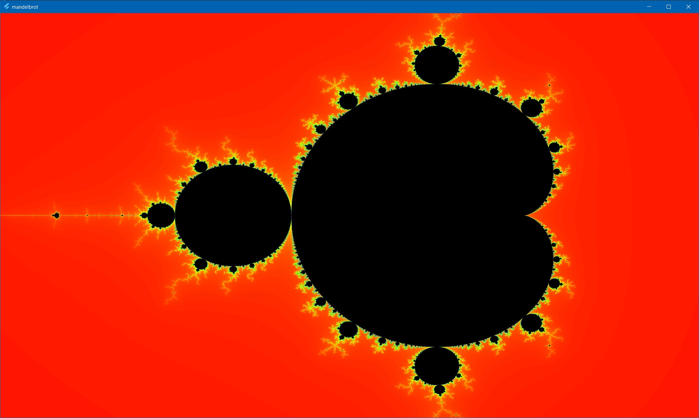
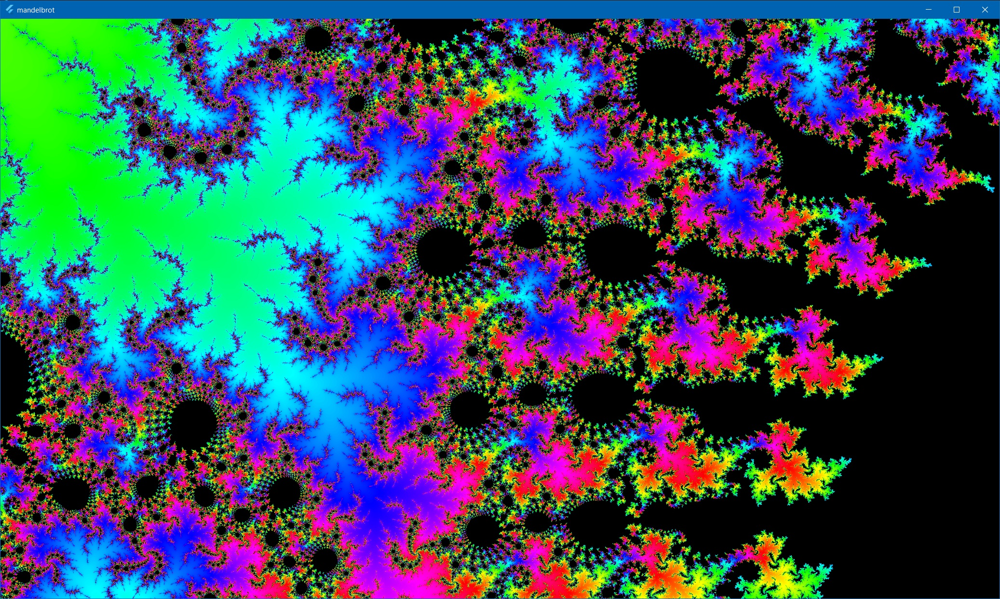

# Flutter CUDA Mandelbrot

A Flutter example application that computes the [Mandelbrot set](https://en.wikipedia.org/wiki/Mandelbrot_set) using CUDA on a NVIDIA GPU



- left-click and drag to zoom into a region
- right-click to go back to the previous sector
- middle-click to reset 

Currently computes 2000 iterations in about 3s for a 3840x2160 frame on a RTX 3090

## Getting Started

```bat
> flutter pub get
```

```bat
> flutter run
```

CUDA code is already compiled to `render.dll` in the `bin\` directory but can be compiled by yourself if you have CUDA 11.6 installed and the `nvcc` command is available. You also need to have VisualStudio installed to run the CUDA `compile.bat`